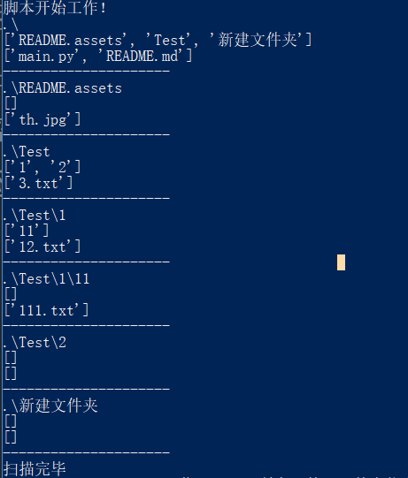

# 遍历目录文件

打算在8.18那几天给用了4年的台机净化一下，系统已经十分臃肿，硬盘分区也十分中二（1T被我分5份拿去显呗盘多你敢信）

众所周知，备份是重做电脑的最大难题。

在精挑细选之后决定留下300多个G宝贵文件，准备备份到笔记本上。

But，某宝上买的读盘器居然没给我电源？？？:frowning:

这让我咋整，9102年还有人自准备硬盘电源的吗

那好 我们还有一个方法，**局域网传输**

一下午时间在笔记本上搭建起FTP，并实际测试一波，效果还好，速度可以达到20M/s

出于懒惰就直接全上传睡觉去了

但当我一醒来激动的望向屏幕上大大的Error，我懵逼了


先不说是为啥错误的，这文件传到哪了啊？我该从哪续传啊？全重传我怕不是脑子出了问题？

于是有了大胆的想法！**脚本万岁**

* 获取已经传完的文件信息
* 将原文件夹内已经传完的文件删除
* 再将剔除传完的文件继续拷过来

#### 好说干就干！


# os.walk(‘%path%’)

树状遍历当前目录下所有的文件夹（包括主目录）

```python
for root,dirs,files in os.walk(file_path):
    #root 遍历到的文件夹路径
    #dirs 文件夹下的文件夹list
    #files 文件夹下的文件list
```




# 开始着手！

那么我们需要做两个脚本

一个是获取已经传输过来的文件，FTP传输的时候设定传输失败的文件自动删除，所以确定没有传半截的文件

另一个是根据已经传完的目录文件删除重复的

### 打印成‘’书‘’！book

获取传输过来的文件清单

遍历目录，将文件分文件夹输出清单，文件清单为8位随机字符

```python
for root,dirs,files in os.walk(file_path):
    outfile.write(str(root)+'?')    #间隔符'?'
    print('目录：'+str(root))
    for f in files:
        outfile.write(str(f)+'?')
        print(f,end='  ') 
    outfile.write('\n')
    print('\n---------------------')
```

采用英文字符`?`间隔数据，因为文件和文件夹名称中不可包含该字符


### 遍历删除	dele

在拥有已经传过来的文件清单之后

那么再做的就是删除清单内所有文件的脚本

* 读取文件清单
* 在扫描目标文件夹时，删除清单内有的文件

```python
    infile = open(sel+'.txt')
    for linestr in infile:
        linelis = linestr.split('?')
        path = linelis[0]
        mapc[path] = set()
        for f in linelis[1:]:
            mapc[path].add(f)

    lis = []
    print('重复文件如下：')
    for root,dirs,files in os.walk('.\\'):
        for f in files:
            if f in mapc[root]:
                #发现重复文件
                #os.remove(str(root)+str(f))
                lis.append(str(root)+str(f))    
                print('$ '+str(root)+str(f))
    
    print('dele[y/n]?:')
    pre = input()
    if pre != 'y':
        print('没有删除，任意键退出')
        os.system('pause>nul')
        exit()


    for f in lis:
        os.remove(f)
        print('rm '+str(root)+str(f))
```


# 更进一步！

文件删除已经完成，但是又想让他变得更加完美

* 处理后的目录存在大量空文件夹
* 存在叠层的无用目录（test/test/test)

我们需要处理这些不太完美的问题

* 删除空文件夹

* 叠层目录路径压缩


### 删除那些空档！deleNULL

* 遍历目录信息存入树状数组
* 为了保证从底部遍历，将数组按字符串长度排序（子文件夹路径一定比父文件夹长）
* 底部遍历删除空文件夹

在一个空文件被删除后，应在他的父亲文件的数组中也将他删除

**子文件夹的路径从后往前数，第一个路径分隔符为界限**，前半部分为父亲路径，后半部分为子文件夹名

```python
path = []
inform = {}
for root,dirs,files in os.walk('.\\'):
    print('\n目录：'+str(root))
    path.append(root)
    inform[root] = set()
    for f in files:
        inform[root].add(f)
        print(f,end='  ')
    for d in dirs:
        inform[root].add(d)
        print(d,end='  ')

     
num = 0
path.sort(reverse=True)
for p in path:
    if len(inform[p])==0:#文件夹为空
        os.rmdir(p)
        father,child = reversed(p[::-1].split('\\',1))
        father = father[::-1]
        child = child[::-1]
        if father=='.':
            father='.\\'
        
        print(father,child)
        inform[father].remove(child)
        
        print('rm '+str(p))
```


# 简直完美！

好了，除了那个去除层叠的脚本都写完了之后，去拯救我那烂摊子传输，效果拔群

虽然其中出现日文编码错误的问题，不过加上UTF-8打开文件就没问题了

还有个别文件没有权限删除，即便开了管理员也不好使，手删了，没整明白是怎么回事:bowing_woman:

不过还是在4秒内检索重复文件并全部删除了，待传输体积直接减小260G，十分满意:happy:

处理无用层叠目录日后再处理，思路和git压缩空目录一样

